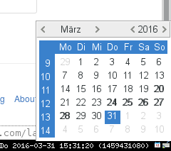

# gcalendar #

gcalendar is a small calendar widget to provide a easy accessible calendar in the tray or as a standalone window.
There is also support for displaying holidays, or any kind of fixed data (maybe relative to a handful of dates).

## Installation ##
Build (needs glib2.0 >= 2.28 and gtk3 >= 3.0):

    $ make
    # make install

## Usage ##
For usage run gcalendar --help. For information on how to use custom holiday files see the examples in data/.

## Examples ##

Example configuration in i3:

    exec --no-startup-id /usr/bin/gcalendar --tray --socket-path=/home/lahol/.gcalendarsocket
    bindcode $mod+49 exec --no-startup-id /usr/bin/gcal-remote --socket-path=/home/lahol/.gcalendarsocket --toggle-display

    # gcalendar
    mode "gcalendar" {
      bindcode 44 exec --no-startup-id /usr/local/bin/gcal-remote --socket-path=/home/lahol/.gcalendarsocket --prev-month
      bindcode 45 exec --no-startup-id /usr/local/bin/gcal-remote --socket-path=/home/lahol/.gcalendarsocket --prev-year
      bindcode 46 exec --no-startup-id /usr/local/bin/gcal-remote --socket-path=/home/lahol/.gcalendarsocket --next-year
      bindcode 47 exec --no-startup-id /usr/local/bin/gcal-remote --socket-path=/home/lahol/.gcalendarsocket --next-month
      bindcode 41 exec --no-startup-id /usr/local/bin/gcal-remote --socket-path=/home/lahol/.gcalendarsocket --today
      bindcode 40 exec --no-startup-id /usr/local/bin/gcal-remote --socket-path=/home/lahol/.gcalendarsocket --toggle-display
      bindcode 36 mode "default"
      bindcode 9 mode "default"
    }
    bindcode $mod+Shift+49 mode "gcalendar"

## License ##

gcalendar is released under a MIT license. See LICENSE for details.
